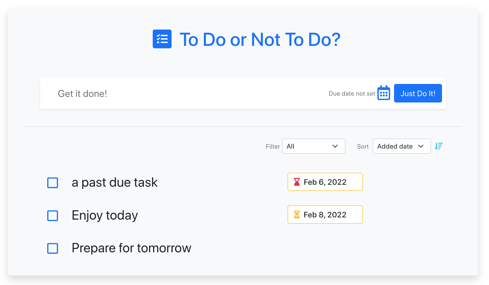

# to do list built with react
A todo list app , where you can add edit and delete todos, together with their due date and created date, you can filter & sort based on a couple of different conditions 

## Usage

* Application will be invoked by using the following command:
    `npm start`

* Users can add a todo

* Update existing todos

* delete a todo 

* Mark a todo as complete or not

* filter completed/active/have-due-date todos

* sort todo based on their created time or due date 

## Features

* JavaScript
* Node
* React

